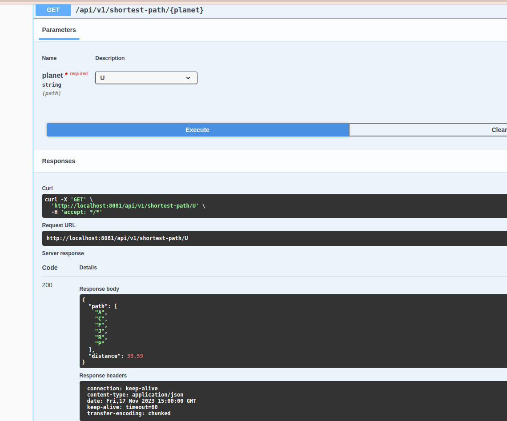

# Interstellar Assessment

## Overview

The interstellar assessment is a Spring Boot based application solving a Graph problem of calculating the shortest path
to a point.
The solution employs Dijkstra's Algorithm to calculate the shortest path problem from a point “A”, being Earth,
through the galaxy to any of the planets represented by the other nodes.

## Basics of Dijkstra's Algorithm

- Dijkstra's Algorithm basically starts at the node that you choose (the source node) and it analyzes the graph to find
  the shortest path between that node and all the other nodes in the graph.
- The algorithm keeps track of the currently known shortest distance from each node to the source node and it updates
  these values if it finds a shorter path.
- Once the algorithm has found the shortest path between the source node and another node, that node is marked as "
  visited" and added to the path.
- The process continues until all the nodes in the graph have been added to the path. This way, we have a path that
  connects the source node to all other nodes following the shortest path possible to reach each node.

## Run Requirements

- JDK 17 (+)
- Maven 3.6.x

## Libraries

- [Caffeine Cache](https://github.com/ben-manes/caffeine)
- Spring Boot (3.1.0)
- H2 Database
- Junit
- Mockito
- Lombok
- Spring Data Jpa
- Spring Web

## Test Limitations
There is no UI to test the application however testing of the graph api is detailed [here](#swagger)


## Assumptions / Rationale

- H2 database is favourited over derby database due to sequence strategy in persistence and the ability
  to continue id generation if a table has already used up identifiers from an allocation, in this case we
  have a csv containing route data and we want to be able to continue generating routes from the REST API
- Java 17 is more consistent with Spring Boot version 3.1.0 and provides jaxb2 dependency OOTB keeping dependency
  transitive, This choice is made to avoid dependency conflicts as we want reliance on jakarta apis and not javax.
- Lombok makes life easy.
- Caffeine caching is used to load graph into memory cache for faster processing time

## Technical Debt
- Since caffeine is used to load already prepopulated graph in cache, when a route ( node to edge ) is added from rest api, 
the cache will load only from memory until eviction time elapses , hence we need to reload the cache from the database to keep data in sync any time an edge is created.

## Local Setup and Deployment

Compile xjc stub classes

```
> ./mvnw compile
```

Then run application

```
> ./mvnw spring-boot:run
```

## Configuration

Configuration can be YAML, .properties file or even env config based

### YAML Property File

```
server:
  port: 8081  # SB Application Port


spring:
  datasource:
    url: jdbc:derby:interstellar;create=true # Can be configured based on needs of server in memory DB

  jpa:
    properties:
      hibernate:
        dialect: org.hibernate.dialect.DerbyTenSevenDialect
    hibernate:
      ddl-auto: update

```

## Swagger  
Swagger testing of the graph api is available via [Swagger](http://localhost:8081/swagger-ui/index.html)
or via terminal launch after application starts up

```
> open http://localhost:8081/swagger-ui/index.html
```

Below is an example of the response while making curl to find shortest path from U to source
```
> curl -X 'GET' \
  'http://localhost:8081/api/v1/shortest-path/U' \
  -H 'accept: */*'
```



## Route Node and Edge REST Documentation

[Documentation](docs/API_DOCS.md#REST)

## Web Service

The application also exposes a webservice that can be viewed from this endpoint

```
> open http://localhost:8081/ws/routes.wsdl
```

To make a WS request here is an example

Request

```
<soapenv:Envelope xmlns:soapenv="http://schemas.xmlsoap.org/soap/envelope/" xmlns:gen="http://assignment.discovery.co.za/gen">
   <soapenv:Header/>
   <soapenv:Body>
      <gen:getShortestPathRequest>
         <gen:planet>U</gen:planet>
      </gen:getShortestPathRequest>
   </soapenv:Body>
</soapenv:Envelope>
```

Response

```
<SOAP-ENV:Envelope xmlns:SOAP-ENV="http://schemas.xmlsoap.org/soap/envelope/">
   <SOAP-ENV:Header/>
   <SOAP-ENV:Body>
      <ns2:getShortestPathResponse xmlns:ns2="http://assignment.discovery.co.za/gen">
         <ns2:distance>39.59</ns2:distance>
         <ns2:paths>A</ns2:paths>
         <ns2:paths>C</ns2:paths>
         <ns2:paths>F</ns2:paths>
         <ns2:paths>J</ns2:paths>
         <ns2:paths>R</ns2:paths>
         <ns2:paths>P</ns2:paths>
      </ns2:getShortestPathResponse>
   </SOAP-ENV:Body>
</SOAP-ENV:Envelope>
```

[Extra Documentation can be found here](docs/API_DOCS.md#SOAP)

## Core Logic

The core logic resides
in [route graph service file](https://github.com/johnsoneyo/interstellar-assessment/blob/master/src/main/java/za/co/discovery/assignment/service/routegraph/RouteGraphService.java)
, the RouteGraph object contains all shortest path distance from source (A -Earth) to all nodes

```
package za.co.discovery.assignment.service.routegraph;

import com.github.benmanes.caffeine.cache.Caffeine;
import com.github.benmanes.caffeine.cache.LoadingCache;
import lombok.Getter;
import lombok.RequiredArgsConstructor;
import lombok.extern.slf4j.Slf4j;
import org.springframework.stereotype.Service;
import za.co.discovery.assignment.bo.Planet;
import za.co.discovery.assignment.dto.RouteDto;
import za.co.discovery.assignment.exception.InvalidSourceConfigException;
import za.co.discovery.assignment.exception.RouteException;
import za.co.discovery.assignment.service.RouteService;

import java.time.Duration;
import java.util.EnumSet;
import java.util.HashSet;
import java.util.LinkedList;
import java.util.List;
import java.util.Map;
import java.util.Set;
import java.util.function.Consumer;
import java.util.stream.Collectors;

/**
 * This class contains only one public method {@link RouteGraphService#getGraph()} ()} which returns  a mapping of all nodes in the graph to source node {@link Planet#A}
 *
 * @see RouteGraphService#getGraph() uses caffeine to load graph in cache
 */
@RequiredArgsConstructor
@Service
@Slf4j
public class RouteGraphService {

    private final RouteService routeService;

    @Getter
    private LoadingCache<String, RouteGraph> graph = Caffeine.newBuilder()
            .maximumSize(10_000)
            .expireAfterWrite(Duration.ofMinutes(30))
            .refreshAfterWrite(Duration.ofMinutes(1))
            .build(key -> get(key));

    /**
     * @param key key used by cache to load graph in the caffeine
     * @return returns a graph of all established shortest paths to a source {@link Planet#A}
     * @throws InvalidSourceConfigException when source node is not configured
     * @throws InvalidSourceConfigException when configured route list is empty
     */
    private RouteGraph get(final String key) {
        log.info("Loading graph into cache for key {}", key);

        final List<RouteGraph.Node> nodes = EnumSet.allOf(Planet.class)
                .stream()
                .map(RouteGraph.Node::new)
                .collect(Collectors.toList());

        List<RouteDto> configuredRoutes = routeService.findAll();
        if (!configuredRoutes.isEmpty()) {
            routeService.findAll()
                    .forEach(defineNodeEdges(nodes));

            RouteGraph routeGraph = RouteGraph.getInstance();
            nodes.forEach(routeGraph::addNode);

            Integer sourceIndex = nodes.indexOf(new RouteGraph.Node(Planet.A));
            if (sourceIndex >= 0) {
                return calculateShortestPathFromSource(routeGraph, nodes.get(sourceIndex));
            }
            throw new RouteException("source route not configured in nodes");
        }

        throw new RouteException("configured routes not defined");
    }

    /**
     * This function defines the nodes to edges by looking up an object through their index in the node list
     *
     * @param nodes receives nodes {@link RouteGraph.Node}
     * @return returns a consumer function
     * @see RouteDto
     * @see RouteGraph.Node
     */
    private Consumer<RouteDto> defineNodeEdges(List<RouteGraph.Node> nodes) {
        return routeDto -> {

            Integer originIndex = nodes.indexOf(new RouteGraph.Node(routeDto.getOrigin()));
            Integer destinationIndex = nodes.indexOf(new RouteGraph.Node(routeDto.getDestination()));

            if (originIndex >= 0 && destinationIndex >= 0) {
                RouteGraph.Node originNode = nodes.get(originIndex);
                RouteGraph.Node destinationNode = nodes.get(destinationIndex);
                originNode.createEdge(destinationNode, routeDto.getDistance());
            }
        };
    }

    /**
     * @param routeGraph
     * @param source
     * @return
     */
    private RouteGraph calculateShortestPathFromSource(RouteGraph routeGraph, RouteGraph.Node source) {

        source.setDistance(0.0);

        Set<RouteGraph.Node> settledNodes = new HashSet<>();
        Set<RouteGraph.Node> unsettledNodes = new HashSet<>();
        unsettledNodes.add(source);

        while (!unsettledNodes.isEmpty()) {
            RouteGraph.Node currentNode = getLowestDistanceNode(unsettledNodes);
            unsettledNodes.remove(currentNode);
            for (Map.Entry<RouteGraph.Node, Double> adjacencyPair : currentNode.getNearbyNodes().entrySet()) {
                RouteGraph.Node adjacentNode = adjacencyPair.getKey();
                Double edgeWeigh = adjacencyPair.getValue();

                if (!settledNodes.contains(adjacentNode)) {
                    calculateMinimumDistance(adjacentNode, edgeWeigh, currentNode);
                    unsettledNodes.add(adjacentNode);
                }
            }
            settledNodes.add(currentNode);
        }
        return routeGraph;
    }

    /**
     * @param evaluationNode
     * @param edgeWeigh
     * @param sourceNode
     */
    private void calculateMinimumDistance(RouteGraph.Node evaluationNode, Double edgeWeigh, RouteGraph.Node sourceNode) {
        Double sourceDistance = sourceNode.getDistance();
        if (sourceDistance + edgeWeigh < evaluationNode.getDistance()) {
            evaluationNode.setDistance(sourceDistance + edgeWeigh);
            LinkedList<RouteGraph.Node> shortestPath = new LinkedList<>(sourceNode.getShortestPath());
            shortestPath.add(sourceNode);
            evaluationNode.setShortestPath(shortestPath);
        }
    }

    /**
     * @param unsettledNodes
     * @return
     */
    private RouteGraph.Node getLowestDistanceNode(Set<RouteGraph.Node> unsettledNodes) {
        RouteGraph.Node lowestDistanceNode = null;
        Double lowestDistance = Double.MAX_VALUE;
        for (RouteGraph.Node node : unsettledNodes) {
            Double nodeDistance = node.getDistance();
            if (nodeDistance < lowestDistance) {
                lowestDistance = nodeDistance;
                lowestDistanceNode = node;
            }
        }
        return lowestDistanceNode;
    }

}


```